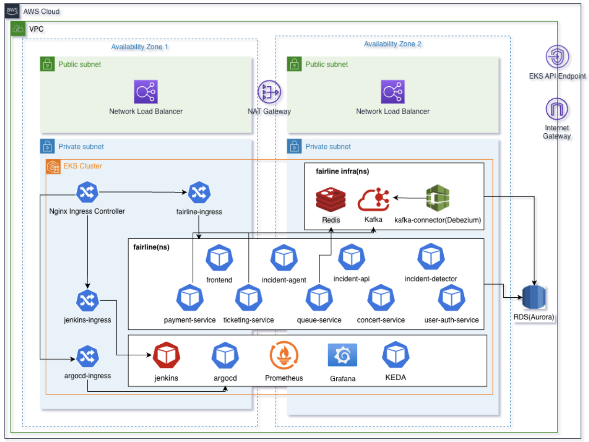
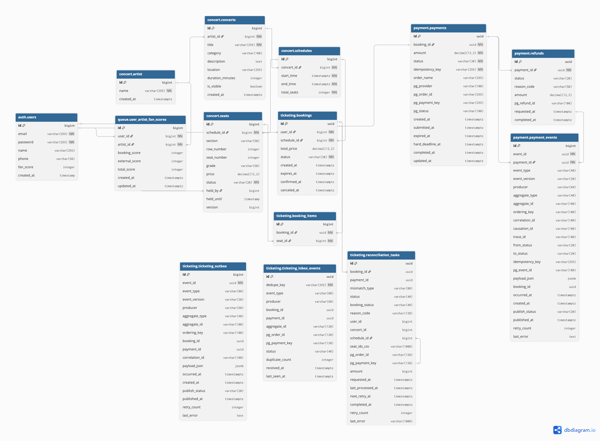

# 0. Getting Started (시작하기)

이 프로젝트는 Docker Compose 기준으로 전체 서비스를 한 번에 실행할 수 있습니다.

```bash
docker compose up --build
```

- 프론트엔드: `http://localhost:5173`
- 사용자 인증 서비스: `http://localhost:18081`
- 공연 서비스: `http://localhost:18082`
- 대기열 서비스: `http://localhost:18083`
- 티켓팅 서비스: `http://localhost:18084`
- 결제 서비스: `http://localhost:18085`
- 장애 탐지 서비스: `http://localhost:18086`
- 장애 분석 서비스: `http://localhost:18087`
- 장애 운영 API: `http://localhost:18088`

- 배포 URL: [Fairline_Ticket](https://skala3-cloud1-team4.cloud.skala-ai.com/main)

- 시연 영상 URL: [Fairline_Ticket_시연_영상](https://drive.google.com/file/d/16pOwPNfq1nIm6pTwDAJfiJxaOWNPq4Ff/view?usp=sharing)

# 1. Project Overview (프로젝트 개요)

- **프로젝트 이름**: Fairline Ticket
- **프로젝트 설명**: 공연 예매 서비스를 MSA로 분리하고, 대기열 제어, 좌석 선점, 결제, 장애 탐지 및 운영 분석까지 포함한 통합 예매 플랫폼
- **프로젝트 목표**:
  - 사용자가 공연 정보를 조회하고 원하는 좌석을 선택해 예매할 수 있는 서비스를 제공합니다.
  - 예매 과정에서 대기열, 좌석 선점, 결제까지 이어지는 전체 흐름을 지원합니다.
  - 운영자는 장애 탐지 및 분석 기능을 통해 예매 시스템 상태를 확인할 수 있습니다.

# 2. Team Members (팀원 및 팀 소개)

| 이름 | 역할 | GitHub |
| --- | --- | --- |
| 서지윤 | User, Concert 서비스 구현, k8s 구현, CI/CD 파이프라인 구축 | [Github](https://github.com/jyo0ny) |
| 양예원 | 결제 서비스 구현, AI 기반 서비스 구현 | [Github](https://github.com/YangYangYewon) |
| 박지현 | 팬 우선 입장, 대기열 서비스 구현, k8s 구현, Observability | [Github](https://github.com/pjhyun0225) |
| 장재훈 | 티켓팅 서비스 구현, Outbox 패턴 도입, CDC 구축 | [Github](https://github.com/l-wanderer01) |

# 3. Key Features (주요 기능)

- **회원 기능**
  - 회원가입, 로그인, JWT 인증
  - 이메일 인증 기반 사용자 검증
- **공연 조회**
  - 공연 목록, 공연 상세, 회차 정보 조회
  - 좌석 맵 및 좌석 상태 조회
- **대기열 제어**
  - 예매 시작 전후 사용자 진입 제어
  - 트래픽 집중 상황에서 순차 입장 처리
- **티켓팅**
  - 좌석 선점 및 예약 생성
  - 예약 만료, 예매 확정, 취소 처리
  - 팬 점수 연동 및 정합성 보정 작업
- **결제**
  - Toss Payments 기반 결제 승인 흐름
  - 결제 성공/실패 리다이렉트 처리
  - 환불 또는 후속 조치가 필요한 건 처리
- **이벤트 기반 운영 처리**
  - Kafka 기반 이벤트 소비
  - Debezium CDC 기반 Outbox 전달
- **장애 탐지 및 분석**
  - 이상 징후 룰 기반 탐지
  - LLM 기반 장애 분석 보조
  - 운영 화면용 장애 조회 API 제공

# 4. Service 단위 책임

- `user-auth-service`
  - 회원가입, 로그인, JWT, 이메일 인증
- `concert-service`
  - 공연/회차/좌석 조회
- `queue-service`
  - 대기열 및 입장 제어
- `ticketing-service`
  - 좌석 선점, 예약, 예매 확정, 팬 점수, 정합성 보정
- `payment-service`
  - 결제 승인, 웹훅, 후속 결제 처리
- `incident-detector`
  - Kafka 이벤트 기반 장애 탐지
- `incident-agent`
  - LLM 기반 장애 분석
- `incident-api`
  - 운영 화면용 장애 데이터 조회 API
- `shared-kernel`
  - 공통 인증, 예외, Redis/JWT 보조 구성
- `frontend`
  - 사용자 예매 화면 및 운영 화면

# 5. Technology Stack (기술 스택)

## 5.1 Language


## 5.2 Frontend


## 5.3 Backend


## 5.4 Infra / DevOps


## 5.5 AI / Operations


# 6. Project Structure (프로젝트 구조)

```text
skala_mini_project/
├── frontend/             # 사용자 예매 화면 및 운영 화면
├── user-auth-service/    # 회원가입, 로그인, JWT, 이메일 인증
├── concert-service/      # 공연/회차/좌석 조회
├── queue-service/        # 예매 대기열 및 진입 제어
├── ticketing-service/    # 좌석 선점, 예약, 확정, 정합성 처리
├── payment-service/      # 결제 승인, 웹훅, 환불 후속 처리
├── incident-detector/    # Kafka 이벤트 기반 장애 탐지
├── incident-agent/       # LLM 기반 장애 분석
├── incident-api/         # 운영용 장애 조회 API
├── shared-kernel/        # 공통 모듈
├── infra/                # 로컬 인프라 및 Debezium 설정
├── stress_test/          # k6 기반 부하 테스트
├── msa-docs/             # 아키텍처 및 문서 자산
├── docs/                 # 보조 문서
├── yewon/                # 목업/시각화 자료
├── fairline_k8s/         # 쿠버네티스 배포 리소스
├── docker-compose.yaml   # 로컬 통합 실행 파일
├── build.gradle          # 멀티모듈 공통 Gradle 설정
└── settings.gradle       # 루트 프로젝트 및 서브모듈 선언
```

# 7. Development Workflow (개발 워크플로우)

## 브랜치 전략 (Branch Strategy)
Git Flow를 기반으로 하여 브랜치 전략 사용
- `main`, `dev`, 팀원 개인 기능 브랜치
- `dev-{name}` : 팀원 각자의 개발 브랜치
- PR merge 방식 : `개인이 생성한 PR에 대해 팀원 1명의 승인이 있어야 PR 내용이 반영되도록 규칙 도입`

## 실행 및 개발 흐름

1. 루트 `.env` 파일에 필수 환경변수를 설정합니다.
2. `docker compose up --build`로 인프라와 애플리케이션을 실행합니다.
3. 프론트엔드는 `5173`, 백엔드 서비스들은 `18081`~`18088` 포트를 사용합니다.
4. 서비스별 상세 구조는 각 디렉토리의 `README.md`에서 확인합니다.
5. 부하 테스트는 `stress_test/` 아래의 k6 스크립트를 사용합니다.

# 8. Environment Variables (환경 변수)

루트 `.env` 기준으로 아래 값들이 필요합니다.

- `DB_USER`
- `DB_PASSWORD`
- `JWT_SECRET`
- `USER_AUTH_INTERNAL_API_TOKEN`
- `CONCERT_INTERNAL_API_TOKEN`
- `TICKETING_INTERNAL_API_TOKEN`
- `PAYMENT_OPS_API_TOKEN`
- `MAIL_USERNAME`
- `MAIL_PASSWORD`
- `EMAIL_FROM_ADDRESS`
- `EMAIL_FROM_NAME`
- `VITE_TOSS_CLIENT_KEY`
- `TOSS_SECRET_KEY`
- `TOSS_API_BASE`
- `TOSS_CONFIRM_URL`
- `TOSS_CANCEL_BASE_URL`
- `PAYMENT_SUCCESS_REDIRECT_URL`
- `PAYMENT_FAIL_REDIRECT_URL`
- `OPENAI_API_KEY`


운영 환경 시크릿 관리 방식:
- 로컬 개발 환경에서는 루트 `.env` 파일로 데이터베이스 계정, JWT 시크릿, 내부 API 토큰, 메일 계정, 결제 연동 키, OpenAI API 키를 주입합니다.
- 운영 배포 환경에서는 Kubernetes `Secret`인 `app-secret`을 사용해 주요 민감 정보를 주입합니다.
- Kubernetes `Secret`에는 데이터베이스 계정 정보, JWT 시크릿, 서비스 간 내부 토큰, 메일 계정, `TOSS_SECRET_KEY`, `OPENAI_API_KEY` 등 서버 측 민감 값이 포함됩니다.
- 정리하면 로컬은 `.env`, 운영은 Kubernetes `Secret`으로 분리해 관리하는 구조입니다.
- 브라우저에 노출될 수 있는 프론트엔드 값과 서버 전용 시크릿은 구분해서 관리해야 하며, 서버 전용 키는 저장소에 직접 하드코딩하지 않고 환경 변수 또는 `Secret`으로만 주입합니다.

# 9. Architecture (아키텍처)



# 10. ERD (데이터베이스 구조)



# 11. References (참고)

- 루트 실행 파일: [docker-compose.yaml](./docker-compose.yaml)
- 프론트엔드 문서: [frontend/README.md](./frontend/README.md)
- 인프라 문서: [infra/README.md](./infra/README.md)
- 서비스별 문서:
  - [user-auth-service/README.md](./user-auth-service/README.md)
  - [concert-service/README.md](./concert-service/README.md)
  - [queue-service/README.md](./queue-service/README.md)
  - [ticketing-service/README.md](./ticketing-service/README.md)
  - [payment-service/README.md](./payment-service/README.md)
  - [incident-detector/README.md](./incident-detector/README.md)
  - [incident-agent/README.md](./incident-agent/README.md)
  - [incident-api/README.md](./incident-api/README.md)
