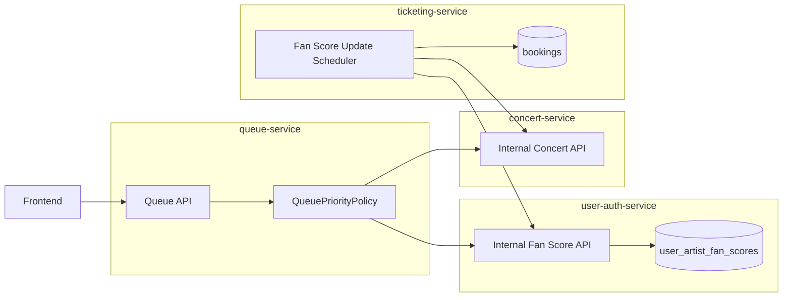
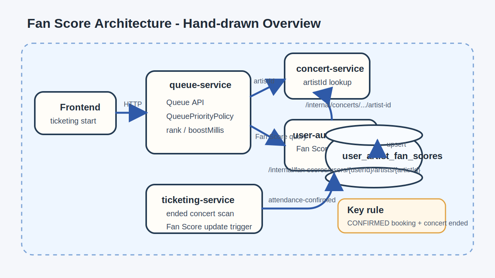
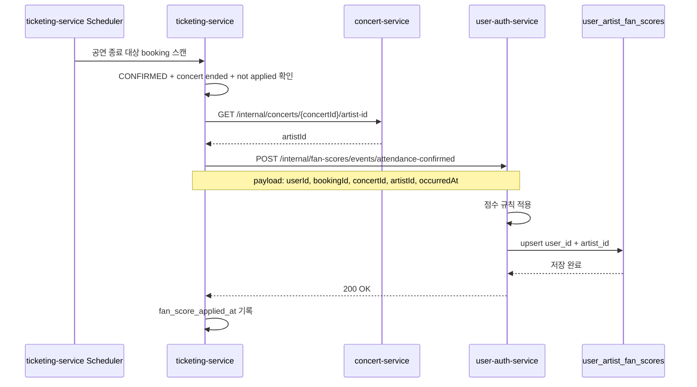
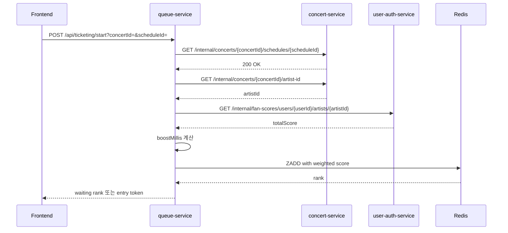

# Fan Score 아키텍처 및 시퀀스 요약

작성일: `2026-05-01`

## 목적

- `Fan Score` 기능의 전체 아키텍처를 발표 자료에 바로 옮길 수 있도록 요약한다.
- 서비스 간 책임과 통신 흐름을 한 번에 설명할 수 있게 `Mermaid` 다이어그램을 포함한다.
- 이번 범위에서의 핵심 설계 의도를 간단한 메시지로 정리한다.

## 설계 요약

- `queue-service`는 `Fan Score`를 직접 계산하지 않는다.
- `queue-service`는 `user-auth-service`에 `internal API`로 `Fan Score`를 조회한다.
- `ticketing-service`는 공연 종료 후 `Fan Score` 반영 대상을 판단하고 `user-auth-service`에 반영 요청을 보낸다.
- `user-auth-service`는 사용자 기준 `Fan Score`를 저장하고 조회한다.
- `concert-service`는 `artistId` 조회를 제공한다.
- 이번 범위에서는 `Kafka` 없이 동기 `HTTP`만 사용한다.

## 아키텍처 다이어그램

아래는 발표 자료에 바로 붙이기 쉬운 hand-drawn style 아키텍처 이미지입니다.

## 아키텍처 설명

- `queue-service`는 티켓팅 시점에 `artistId`와 `Fan Score`를 조회한 뒤 우선순위만 계산한다.
- `ticketing-service`는 원본 `booking` 데이터를 기준으로 `Fan Score` 반영 대상을 찾아낸다.
- `user-auth-service`는 최종 `Fan Score` 저장소 역할을 맡는다.
- `concert-service`는 `concertId -> artistId` 변환 책임을 가진다.

## 시퀀스 다이어그램 1: Fan Score 반영

## 시퀀스 다이어그램 2: 티켓팅 시점 Fan Score 조회

## 핵심 설계 포인트

### 작업목록

- `queue-service`는 조회만 담당
- `ticketing-service`는 반영 트리거 담당
- `user-auth-service`는 저장/조회 담당
- 중복 반영은 `booking` 단위로 방지

### 작업 내용

- 티켓팅 버튼을 누를 때 원본 예매 내역을 계산하지 않도록 사전 반영 구조를 선택했다.
- 반영 시점은 `예매 확정 + 공연 종료` 이후로 제한했다.
- 실시간 티켓팅 응답 속도를 위해 점수 계산이 아닌 점수 조회 구조로 설계했다.

### 적용내용

- `queue-service -> user-auth-service`: 동기 `HTTP` 조회
- `ticketing-service -> user-auth-service`: 동기 `HTTP` 반영 요청
- `bookings.fan_score_applied_at` 방식의 중복 방지 기본안 사용

## 현재 구현 상태

- `user-auth-service`
  - `GET /internal/fan-scores/users/{userId}/artists/{artistId}`
  - `POST /internal/fan-scores/events/attendance-confirmed`
- `ticketing-service`
  - `FanScoreSyncScheduler` 추가
  - startup sync와 주기 sync 모두 `CONFIRMED + concert ended + not applied` 기준 사용
  - `bookings.fan_score_applied_at` 컬럼 사용
- `queue-service`
  - `QueuePriorityPolicy`가 `concert-service`와 `user-auth-service`를 호출해 실제 `boostMillis` 계산
  - downstream 실패 시 `neutral(0)` fallback 유지

## 발표 시 강조 포인트

- 이번 설계의 핵심은 `queue-service`가 다시 DB 직접 조회 구조로 돌아가지 않게 한 점이다.
- `Fan Score`는 실시간 계산이 아니라 사전 반영된 값을 조회하는 방식으로 설계했다.
- 기능 구현 후에는 로컬 시나리오 검증뿐 아니라 `Docker`와 `Kubernetes` 환경에서도 같은 `HTTP` 통신 구조를 유지할 수 있다.
