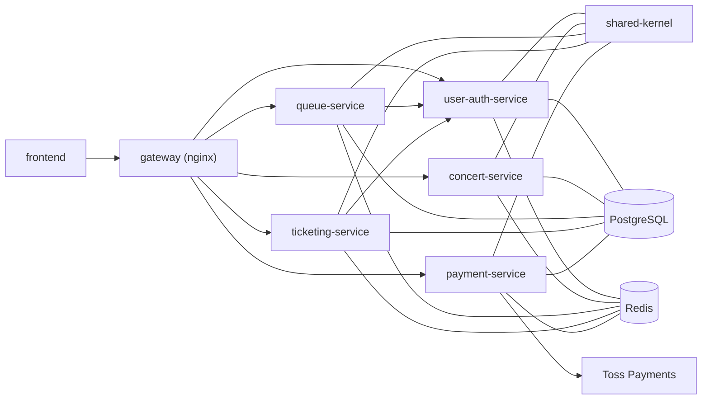
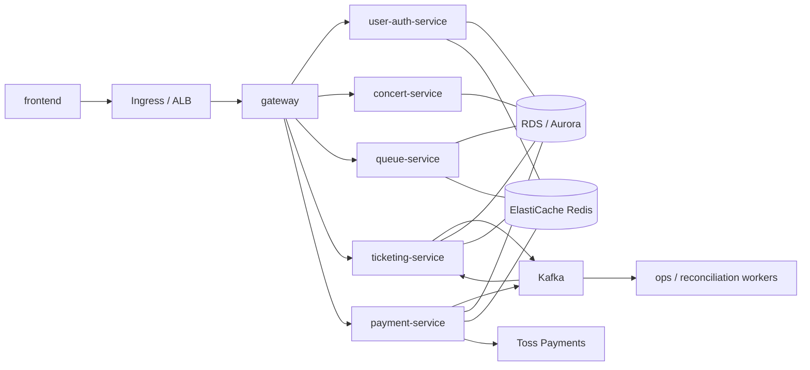
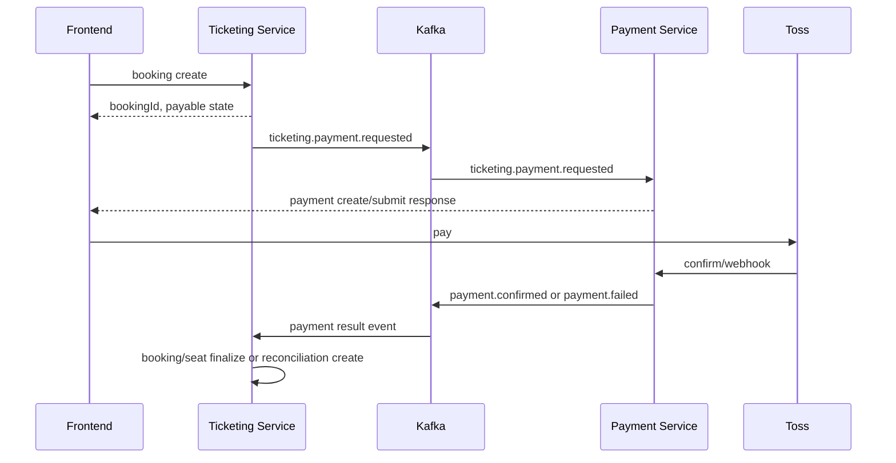
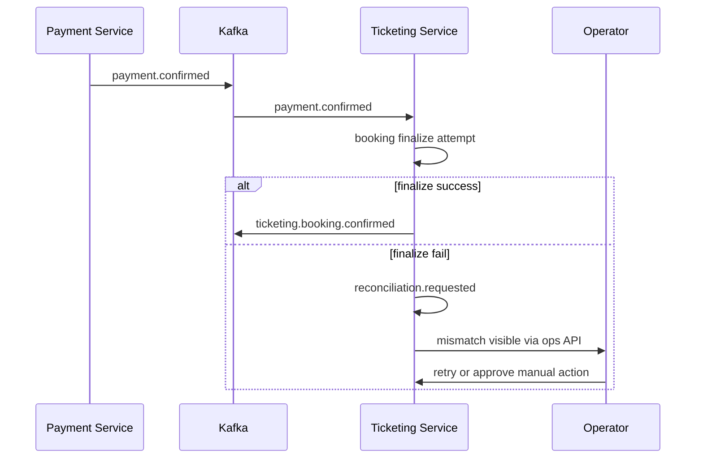
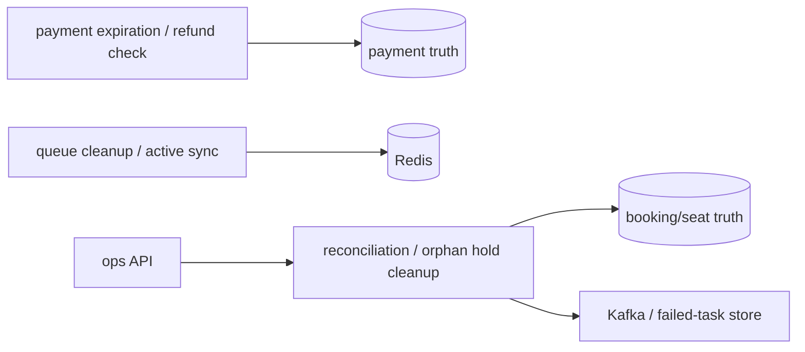
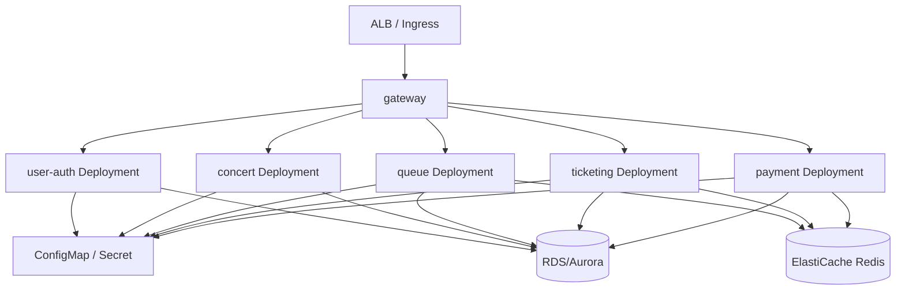

# 서비스 운영/완성도 설계

## 1. 문서 목적과 적용 범위

이 문서는 `dev` 브랜치 기준 현재 MSA 구조를 `운영 가능한 수준`으로 끌어올리기 위한 기준서다.

문서의 목적은 아래와 같다.

- 현재 `dev` 구조의 사실을 명확히 기록한다.
- EKS 운영 전제를 반영한 목표 구조를 규범으로 고정한다.
- 여러 AI와 여러 개발자가 읽어도 같은 서비스 경계, 같은 운영 기준, 같은 수정 방향으로 수렴하게 만든다.
- 향후 코드 수정, 리팩터링, 운영 자동화, 배포 표준화의 기준 문서로 사용한다.

본 문서는 `결제 운영 진단 Agent`보다 상위에 위치한 서비스 운영 기준 문서다. Agent는 이 문서 위에 쌓이는 운영 보조 계층으로 취급한다.

### 비목표

- 현재 `dev` 구현을 있는 그대로 승인하는 문서
- 곧바로 모든 마이크로서비스를 완전 독립 DB로 분리하는 실행 계획
- 운영자 승인 없는 자동 환불, 자동 강제 확정, 자동 강제 취소의 즉시 도입
- 특정 클라우드 서비스의 상세 Terraform 또는 Helm 차트 설계

### 문서 사용 원칙

- 현재 구조 설명과 목표 구조 규범을 섞지 않는다.
- 과도기 예외는 목표 구조로 취급하지 않는다.
- 문서와 다른 구조를 택하려면 별도 예외 합의가 필요하다.

## 2. 현재 `dev` 구조의 사실

현재 `dev` 브랜치는 실행 단위 기준으로는 MSA 형태를 취하고 있지만, 운영 경계와 데이터 경계는 아직 완전히 닫히지 않았다.

### 2.1 현재 서비스 구성

| 서비스 | 현재 역할 | 외부 노출 경로 | 현재 직접 의존 | 스케줄러 | 주요 운영 리스크 |
|---|---|---|---|---|---|
| `user-auth-service` | 회원가입, 로그인, JWT, 이메일 인증, 내부 사용자 조회 | `/api/users/**`, `/internal/users/**` | `shared-kernel`, 공용 Postgres, Redis | 없음 | 팬점수 로직 결합, 내부 조회 보호 약함 |
| `concert-service` | 공연/회차/좌석 조회 | `/api/concerts/**` | `shared-kernel`, 공용 Postgres, Redis | 없음 | 조회 전용이지만 shared-kernel 경계가 넓음 |
| `queue-service` | 대기열 진입, 상태 조회, 입장 토큰 발급/소비 | `/api/ticketing/**` | `user-auth-service` HTTP, `shared-kernel`, 공용 Postgres, Redis | 있음 | Redis 상태와 실제 활성 좌석 수 정합성 관리 필요 |
| `ticketing-service` | 좌석 hold, 좌석 해제, 예약 생성, 예약 조회 | `/api/seats/**`, `/api/bookings/**` | `user-auth-service` HTTP, `shared-kernel`, 공용 Postgres, Redis | 없음 | inventory truth를 가져야 하나 payment와 경계가 덜 닫힘 |
| `payment-service` | 결제 생성/제출/확정, Toss webhook, 환불 요청/완료, 운영 요약 | `/api/payments/**` | `shared-kernel`, 공용 Postgres, Redis, Toss API | 있음 | booking/seat 직접 접근 흔적, webhook/재처리 표준 부족 |
| `gateway` | 외부 진입 프록시 | `:8080` | 각 백엔드 서비스 | 없음 | 단순 라우팅 이상 책임을 가지면 안 됨 |
| `frontend` | 사용자 웹 앱 | `:5173` | gateway | 없음 | API 실패/중간 상태 UX 표준 필요 |
| `shared-kernel` | 공통 설정, JWT, Redis 유틸, 일부 도메인 엔티티/리포지토리 | 직접 노출 없음 | 각 백엔드 서비스가 의존 | 없음 | 과도하게 넓은 공유 범위로 서비스 경계 약화 |

### 2.2 현재 공용 인프라 사실

| 자원 | 현재 상태 | 현재 사용 서비스 | 현재 문제 |
|---|---|---|---|
| PostgreSQL | 컨테이너 1개 공용 | 모든 백엔드 서비스 | 서비스별 저장 책임이 애플리케이션 규칙에만 의존 |
| Redis | 컨테이너 1개 공용 | user-auth, queue, ticketing, payment | queue, hold, blacklist, verification 등 다양한 책임 혼재 |
| Nginx gateway | 단일 프록시 | frontend, 5개 백엔드 | 운영 정책/보안 정책이 명시적으로 닫히지 않음 |

### 2.3 현재 직접 호출 구조

- `queue-service -> user-auth-service` HTTP 호출
- `ticketing-service -> user-auth-service` HTTP 호출
- `payment-service -> Toss Payments` 외부 HTTP 호출
- `payment-service`는 현재 코드 기준으로 booking/seat 쪽 shared repository 를 통해 inventory 영역에 직접 관여하는 흔적이 있다.

### 2.4 현재 스케줄러 사실

| 서비스 | 스케줄러 | 주기 | 현재 역할 |
|---|---|---|---|
| `queue-service` | `QueueScheduler` | 10초 | stale queue member cleanup |
| `queue-service` | `ActiveSeatCleanupScheduler` | 10초 | active seat count 동기화 |
| `payment-service` | `PaymentScheduler` | 15초 | 결제 만료 스캔, `EXPIRED` 전환, 후속 정리 |

### 2.5 현재 구조 다이어그램

### 2.6 현재 구조의 운영 갭

| 갭 | 설명 | 왜 위험한가 |
|---|---|---|
| shared-kernel 과대화 | 도메인 엔티티/리포지토리까지 공유 | 서비스 경계 침범이 쉬워짐 |
| 공용 DB 과도기 상태 | 모든 서비스가 같은 DB 인스턴스를 사용 | 소유권이 문서가 아니라 관성에 기대게 됨 |
| payment의 ticketing 경계 침범 | payment가 booking/seat 후처리까지 일부 수행 | truth source 와 workflow owner 혼선 |
| event backbone 부재 | 현재 핵심 정합성 복구가 이벤트 표준으로 닫히지 않음 | 재처리와 멱등성이 구현자 재량으로 흔들림 |
| observability 기준 부족 | health, metrics, alert 기준이 문서화되지 않음 | 운영 가능성 판단이 사람 감각에 의존 |
| 내부 인증 표준 부족 | `/internal/**`, 운영 API 보호 범위가 느슨함 | 클러스터 내부 오용/오작동 위험 |

## 3. 목표 구조 원칙

### 3.1 핵심 원칙

- 결제 상태의 최종 진실은 `payment-service` 가 가진다.
- booking/seat/inventory 상태의 최종 진실은 `ticketing-service` 가 가진다.
- 결제와 예매 상태가 어긋났을 때 복구 workflow owner 는 `ticketing-service` 다.
- 사용자 체감 응답은 필요한 최소 범위만 동기 처리한다.
- 핵심 정합성 복구는 `event backbone + outbox/inbox + reconciliation` 구조를 필수 목표로 둔다.
- 공용 DB와 shared-kernel 은 과도기만 허용한다.
- 운영 자동화는 멱등하고 안전한 상태 정렬까지만 허용한다.
- 환불, 강제 확정, 강제 취소는 운영자 승인 또는 별도 안전 절차를 요구한다.

### 3.2 truth source 와 workflow owner

| 도메인 상태 | authoritative truth | mismatch 감지 서비스 | workflow owner | 자동 복구 허용 |
|---|---|---|---|---|
| `payment` | `payment-service` | `ticketing-service`, ops batch | `ticketing-service` | 일부 |
| `booking` | `ticketing-service` | `ticketing-service` | `ticketing-service` | 일부 |
| `seat / hold / reserve` | `ticketing-service` | `ticketing-service`, queue cleanup | `ticketing-service` | 일부 |
| `refund` | `payment-service` | `payment-service`, ticketing reconciliation | `payment-service` + 운영 승인 | 제한적 |
| `queue admission` | `queue-service` | `queue-service` | `queue-service` | 일부 |

### 3.3 목표 운영 구조 다이어그램

## 4. 서비스별 책임 표준

### 4.1 서비스 책임 매트릭스

| 서비스 | owned APIs | owned data | authoritative state | publishes | consumes | allowed sync dependencies | forbidden access |
|---|---|---|---|---|---|---|---|
| `user-auth-service` | `/api/users/**`, `/internal/users/**` | users, verification state, auth metadata | user/account/auth | `user.created`, `user.updated` 후보 | 없음 또는 auth 관련 이벤트 | 없음 | 타 서비스 booking/payment/seat 상태 수정 |
| `concert-service` | `/api/concerts/**` | concert, schedule, readonly seat view | concert catalog | catalog change 후보 | 없음 | 없음 | inventory truth, payment truth 판정 |
| `queue-service` | `/api/ticketing/**` | queue rank cache, entry token, active count | queue admission | `queue.admitted`, `queue.expired` 후보 | 필요 시 user/profile 관련 이벤트 | `user-auth-service` | booking, payment 상태 직접 수정 |
| `ticketing-service` | `/api/seats/**`, `/api/bookings/**`, `/ops/reconciliations/**` | booking, booking items, seat hold/reserve, reconciliation task | booking/seat truth | `ticketing.payment.requested`, `ticketing.booking.confirmed`, `ticketing.reconciliation.*` | `payment.*` 핵심 이벤트 | `user-auth-service` | payment table 직접 쓰기, PG 직접 호출 |
| `payment-service` | `/api/payments/**`, `/ops/payments/**` | payment, payment events, refund, outbox | payment truth | `payment.created`, `payment.submitted`, `payment.confirmed`, `payment.failed`, `payment.expired`, `payment.refund_required` | `ticketing.payment.requested` | Toss API | booking/seat DB 직접 쓰기, inventory truth 판정 |
| `gateway` | 외부 라우팅 | 없음 | 없음 | 없음 | 없음 | 모든 백엔드 프록시 | 도메인 상태 소유 |

### 4.2 데이터 소유권 표

| 엔티티/테이블 | 현재 위치 | 목표 소유 서비스 | 타 서비스 조회 허용 | 타 서비스 쓰기 허용 | 과도기 예외 |
|---|---|---|---|---|---|
| `users` | shared Postgres | `user-auth-service` | 내부 API로만 허용 | 금지 | 현재 shared DB |
| `concerts`, `schedules` | shared Postgres | `concert-service` | readonly API/replica view 허용 | 금지 | 현재 shared DB |
| `bookings`, `booking_items` | shared Postgres | `ticketing-service` | payment는 이벤트/ops API만 사용 | 금지 | 현재 payment 코드 일부 침범 |
| `seats` inventory truth | shared Postgres | `ticketing-service` | concert는 readonly projection 만 허용 | 금지 | 현재 shared repository 침범 |
| `payments`, `payment_events`, `refunds` | shared Postgres | `payment-service` | ticketing은 이벤트/ops API만 사용 | 금지 | 현재 shared DB |
| queue redis keys | Redis | `queue-service` | 다른 서비스 직접 사용 금지 | 금지 | 없음 |
| seat hold redis keys | Redis | `ticketing-service` | queue는 active count 정리 범위만 제한적 관여 | 금지 | 현재 queue cleanup 일부 관여 |

### 4.3 shared-kernel 의 과도기 위치

- 현재 shared-kernel 은 과도기 모듈이다.
- 잔존 허용 범위:
  - 공통 에러 응답 포맷
  - JWT/보안 유틸
  - Redis key 규약
  - 이벤트 계약 DTO
- 금지 목표:
  - 타 서비스 도메인 entity 공유
  - 타 서비스 JPA repository 공유
  - 서비스 경계를 흐리는 비즈니스 로직 공유

## 5. 동기/비동기 경계 표준

### 5.1 플로우 경계 표

| 플로우 | 시작 주체 | 동기 구간 | 비동기 구간 | 완료 판정 주체 | retry owner | 운영자 확인 포인트 |
|---|---|---|---|---|---|---|
| 로그인/회원가입 | frontend -> `user-auth-service` | 전체 | 없음 | `user-auth-service` | 없음 | auth 실패율 |
| 공연 조회 | frontend -> `concert-service` | 전체 | 없음 | `concert-service` | 없음 | 조회 latency |
| 대기열 시작/상태 조회 | frontend -> `queue-service` | 전체 | stale cleanup 은 배치 | `queue-service` | `queue-service` | queue depth, active drift |
| 좌석 hold/release | frontend -> `ticketing-service` | hold/release 응답까지 | orphan cleanup | `ticketing-service` | `ticketing-service` | hold conflict, stale hold |
| booking 생성 | frontend -> `ticketing-service` | booking 생성/응답까지 | 이후 payment request 발행 | `ticketing-service` | `ticketing-service` | booking 생성 실패 |
| payment 생성/submit | frontend -> `payment-service` | create/submit 응답까지 | 이후 PG callback, webhook, reconciliation | `payment-service` | `payment-service` | payment create failure |
| payment confirm/webhook | Toss/redirect -> `payment-service` | payment truth 반영까지 | ticketing finalization, reconciliation | `payment-service` | `payment-service` + `ticketing-service` | duplicate webhook, late confirm |
| booking-seat finalization | `ticketing-service` consumer | 없음 | 전체 | `ticketing-service` | `ticketing-service` | confirmation lag |
| refund_required marking | `payment-service` / reconciliation | 일부 동기 truth 반영 | ops review, refund workflow | `payment-service` | `payment-service` | refund_required count |
| reconciliation replay | ops API / batch | task 생성까지 | 전체 | `ticketing-service` | `ticketing-service` | backlog, exhausted task |

### 5.2 핵심 handshake

정규 목표 흐름은 아래와 같다.

1. `ticketing-service` 가 `ticketing.payment.requested` 이벤트를 발행한다.
2. `payment-service` 가 이를 소비해 payment 생성/진행/확정한다.
3. `payment-service` 가 `payment.confirmed` 또는 `payment.failed` 를 발행한다.
4. `ticketing-service` 가 이를 소비해 booking/seat 를 최종 확정하거나 reconciliation task 를 생성한다.

### 5.3 결제-예매 핵심 시퀀스 다이어그램

## 6. authoritative truth 와 불일치 판정 규칙

### 6.1 mismatch decision table

| mismatch type | payment truth | booking/seat truth | workflow owner | auto-fix | manual approval | 기본 조치 |
|---|---|---|---|---|---|---|
| `PAYMENT_CONFIRMED_BOOKING_NOT_CONFIRMED` | confirmed | not confirmed | `ticketing-service` | 예 | 아니오 | finalization retry |
| `PAYMENT_CONFIRMED_SEAT_NOT_RESERVED` | confirmed | seat not reserved | `ticketing-service` | 예 | 아니오 | reserve retry + incident |
| `BOOKING_CONFIRMED_PAYMENT_NOT_CONFIRMED` | not confirmed | confirmed | `ticketing-service` + `payment-service` | 제한적 | 예 | mismatch freeze + ops review |
| `HOLD_EXPIRED_LATE_PAYMENT` | late paid | hold expired | `ticketing-service` | 부분 | 예 | refund_required 검토 |
| `DUPLICATE_WEBHOOK` | same payment duplicated | no booking change expected | `payment-service` | 예 | 아니오 | dedupe discard |
| `ORPHAN_HELD_SEAT` | irrelevant | held remains | `ticketing-service` | 예 | 아니오 | orphan hold cleanup |
| `RECONCILIATION_EXHAUSTED` | any | any | `ticketing-service` | 아니오 | 예 | ops replay / manual correction |

### 6.2 복구 시퀀스 다이어그램

### 6.3 canonical 상태 전이 표

#### Payment 상태 전이

| 상태 | 진입 조건 | 진입 이벤트 | 전이 가능 상태 | 금지 전이 | owner | retry 가능 여부 | 수동 개입 필요 여부 |
|---|---|---|---|---|---|---|---|
| `PENDING` | 결제 생성 직후 | `payment.created` | `PAYING`, `CANCELED`, `EXPIRED` | `CONFIRMED`, `REFUNDED` 직접 전이 | `payment-service` | 아니오 | 아니오 |
| `PAYING` | PG 제출 완료 | `payment.submitted` | `PAID`, `FAILED`, `CANCELED`, `EXPIRED` | `REFUNDED` 직접 전이 | `payment-service` | 예 | 아니오 |
| `PAID` | PG 승인 확보, 내부 confirm 전 | `payment.paid` | `CONFIRMED` | `CANCELED`, `REFUNDED` 직접 전이 | `payment-service` | 예 | 아니오 |
| `CONFIRMED` | payment truth 확정 | `payment.confirmed` | terminal, 필요 시 `REFUND_REQUIRED` 후보 | `PAYING`, `PENDING` 복귀 | `payment-service` | 제한적 | mismatch 시 예 |
| `FAILED` | PG 또는 내부 결제 실패 | `payment.failed` | terminal | `CONFIRMED` | `payment-service` | 아니오 | 아니오 |
| `CANCELED` | 사용자 취소 또는 운영 취소 | `payment.canceled` | terminal | `CONFIRMED` | `payment-service` | 아니오 | 예 |
| `EXPIRED` | expiration scan 또는 deadline 초과 | `payment.expired` | `REFUND_REQUIRED` | `PAYING`, `PAID` 직접 복귀 | `payment-service` | 예 | late payment 시 예 |
| `REFUND_REQUIRED` | late success 또는 mismatch | `payment.refund_required` | `REFUNDED`, `CANCELED` | `CONFIRMED` 직접 복귀 | `payment-service` | 제한적 | 예 |
| `REFUNDED` | 환불 완료 | `payment.refunded` | terminal | 모든 비terminal 복귀 | `payment-service` | 아니오 | 예 |

#### Booking 상태 전이

| 상태 | 진입 조건 | 진입 이벤트 | 전이 가능 상태 | 금지 전이 | owner | retry 가능 여부 | 수동 개입 필요 여부 |
|---|---|---|---|---|---|---|---|
| `HOLDING` | 좌석 hold 기반 예약 생성 | `booking.created` | `CONFIRMING`, `EXPIRED`, `CANCELED` | `CONFIRMED` 직접 점프를 기본 경로로 사용 금지 | `ticketing-service` | 아니오 | 아니오 |
| `CONFIRMING` | payment confirmed 수신 후 finalization 시작 | `ticketing.finalization.started` | `CONFIRMED`, `RECONCILING` | `HOLDING` 무조건 복귀 | `ticketing-service` | 예 | 아니오 |
| `CONFIRMED` | booking/seat finalization 성공 | `ticketing.booking.confirmed` | terminal 또는 보상 흐름 | `HOLDING`, `CONFIRMING` 복귀 | `ticketing-service` | 제한적 | mismatch 시 예 |
| `EXPIRED` | hold/payment timeout | `booking.expired` | terminal 또는 `RECONCILING` | `CONFIRMED` 직접 전이 | `ticketing-service` | 제한적 | late paid 시 예 |
| `CANCELED` | 사용자/운영 취소 | `booking.canceled` | terminal | `CONFIRMED` 직접 복귀 | `ticketing-service` | 아니오 | 예 |
| `RECONCILING` | mismatch 또는 finalization 실패 | `ticketing.reconciliation.requested` | `CONFIRMED`, `CANCELED`, `EXPIRED` | 무근거 terminal 확정 | `ticketing-service` | 예 | exhausted 시 예 |

#### Seat 상태 전이

| 상태 | 진입 조건 | 진입 이벤트 | 전이 가능 상태 | 금지 전이 | owner | retry 가능 여부 | 수동 개입 필요 여부 |
|---|---|---|---|---|---|---|---|
| `AVAILABLE` | 예약 가능 기본 상태 | 초기 상태 | `HELD` | `RESERVED` 직접 점프 | `ticketing-service` | 아니오 | 아니오 |
| `HELD` | 사용자 hold 성공, TTL 유효 | `seat.held` | `RESERVED`, `AVAILABLE`, `ORPHAN_HELD` | 무조건적 `RESERVED` | `ticketing-service` | 예 | 아니오 |
| `RESERVED` | booking confirmed 시점 | `seat.reserved` | terminal 또는 운영 보상 흐름 | `AVAILABLE` 직접 복귀 | `ticketing-service` | 제한적 | 예 |
| `RELEASING` | cleanup 또는 cancel 과정 | `seat.releasing` | `AVAILABLE`, `ORPHAN_HELD` | `RESERVED` 직접 확정 | `ticketing-service` | 예 | 아니오 |
| `ORPHAN_HELD` | TTL 경과 후 hold 잔존 | `seat.orphan_detected` | `AVAILABLE`, `RECONCILED_RESERVED` 개념적 처리 | 장기 잔존 방치 | `ticketing-service` | 예 | exhausted 시 예 |

#### Refund 상태 전이

| 상태 | 진입 조건 | 진입 이벤트 | 전이 가능 상태 | 금지 전이 | owner | retry 가능 여부 | 수동 개입 필요 여부 |
|---|---|---|---|---|---|---|---|
| `REQUESTED` | refund_required 후 환불 요청 생성 | `refund.requested` | `PROCESSING`, `CANCELED` | `COMPLETED` 직접 점프 | `payment-service` | 제한적 | 예 |
| `PROCESSING` | PG/운영 처리 시작 | `refund.processing` | `COMPLETED`, `FAILED` | `REQUESTED` 무조건 복귀 | `payment-service` | 예 | 예 |
| `COMPLETED` | 환불 완료 | `refund.completed` | terminal | 비terminal 복귀 | `payment-service` | 아니오 | 예 |
| `FAILED` | 환불 처리 실패 | `refund.failed` | `PROCESSING`, `CANCELED` | `COMPLETED` 무근거 전이 | `payment-service` | 예 | 예 |
| `CANCELED` | 운영 취소 | `refund.canceled` | terminal | `COMPLETED` | `payment-service` | 아니오 | 예 |

#### Reconciliation Task 상태 전이

| 상태 | 진입 조건 | 진입 이벤트 | 전이 가능 상태 | 금지 전이 | owner | retry 가능 여부 | 수동 개입 필요 여부 |
|---|---|---|---|---|---|---|---|
| `REQUESTED` | mismatch 감지 | `ticketing.reconciliation.requested` | `RUNNING`, `WAITING_MANUAL_APPROVAL` | `COMPLETED` 직접 점프 | `ticketing-service` | 예 | 아니오 |
| `RUNNING` | worker 가 task 점유 | `reconciliation.started` | `COMPLETED`, `RETRY_WAIT`, `FAILED_PERMANENT` | `REQUESTED` 복귀 | `ticketing-service` | 예 | 아니오 |
| `RETRY_WAIT` | 재시도 backoff 대기 | `reconciliation.retry_scheduled` | `RUNNING`, `FAILED_PERMANENT` | `COMPLETED` 직접 점프 | `ticketing-service` | 예 | 아니오 |
| `COMPLETED` | mismatch 해소 | `ticketing.reconciliation.completed` | terminal | 비terminal 복귀 | `ticketing-service` | 아니오 | 아니오 |
| `FAILED_PERMANENT` | retry exhausted 또는 정책상 자동 복구 중단 | `reconciliation.failed_permanent` | `WAITING_MANUAL_APPROVAL` | 자동 `COMPLETED` | `ticketing-service` | 아니오 | 예 |
| `WAITING_MANUAL_APPROVAL` | 환불/강제조치/애매한 상태 | `reconciliation.manual_required` | `RUNNING`, `COMPLETED` | 자동 terminal 확정 | `ticketing-service` | 운영자 승인 후 | 예 |

#### Queue Admission 상태

| 상태 | 진입 조건 | 진입 이벤트 | 전이 가능 상태 | 금지 전이 | owner | retry 가능 여부 | 수동 개입 필요 여부 |
|---|---|---|---|---|---|---|---|
| `WAITING` | queue 진입 | `queue.entered` | `ADMITTED`, `EXPIRED` | `TOKEN_CONSUMED` 직접 점프 | `queue-service` | 아니오 | 아니오 |
| `ADMITTED` | active capacity 확보 | `queue.admitted` | `TOKEN_ISSUED`, `EXPIRED` | `WAITING` 복귀 | `queue-service` | 예 | 아니오 |
| `TOKEN_ISSUED` | entry token 발급 | `queue.token_issued` | `TOKEN_CONSUMED`, `EXPIRED` | `WAITING` 복귀 | `queue-service` | 제한적 | 아니오 |
| `TOKEN_CONSUMED` | token 사용 완료 | `queue.token_consumed` | terminal | 비terminal 복귀 | `queue-service` | 아니오 | 아니오 |
| `EXPIRED` | heartbeat/token TTL 만료 | `queue.expired` | terminal | `TOKEN_CONSUMED` 직접 복귀 | `queue-service` | 아니오 | 아니오 |

## 7. 이벤트 계약 표준

### 7.1 공통 이벤트 메타

| 필드 | 설명 | 필수 여부 |
|---|---|---|
| `eventId` | 전역 유일 이벤트 ID | 필수 |
| `eventType` | 이벤트 타입 코드 | 필수 |
| `eventVersion` | 버전 | 필수 |
| `occurredAt` | 이벤트 발생 시각(UTC) | 필수 |
| `producer` | 발행 서비스명 | 필수 |
| `aggregateType` | aggregate 종류 | 필수 |
| `aggregateId` | aggregate ID | 필수 |
| `orderingKey` | 파티션/정렬 키 | 필수 |
| `idempotencyKey` | 중복 방지 키 | 필수 |
| `correlationId` | 요청/흐름 추적 ID | 필수 |
| `causationId` | 직전 원인 이벤트 ID | 선택 |
| `traceId` | tracing ID | 선택 |
| `payload` | 도메인 payload | 필수 |

### 7.2 naming / versioning / ordering 규칙

- topic naming: `<domain>.<entity>.<action>.v1`
- event type naming: `DOMAIN_ENTITY_ACTION`
- payment 관련 ordering key: `paymentId`
- booking/seat 관련 ordering key: `bookingId`
- replay 는 at-least-once 전제를 따른다.
- 소비자는 duplicate-safe 해야 한다.
- 재시도 한도 초과 시 DLQ 또는 failed-task store 로 이동한다.

### 7.3 필수 이벤트 계약 표

| 이벤트 | 발행 주체 | 발행 조건 | 소비 주체 | ordering key | 필수 payload 필드 | 중복 허용 규칙 |
|---|---|---|---|---|---|---|
| `ticketing.payment.requested` | `ticketing-service` | booking 생성 후 결제 가능 상태 | `payment-service` | `bookingId` | `bookingId`, `userId`, `concertId`, `scheduleId`, `seatIds`, `amount`, `orderName`, `requestedAt` | 동일 booking 재발행 시 idempotency key 기준 dedupe |
| `payment.created` | `payment-service` | payment row 생성 | ops / audit | `paymentId` | `paymentId`, `bookingId`, `amount`, `paymentStatus`, `pgProvider`, `createdAt` | 같은 paymentId 재발행 가능 |
| `payment.submitted` | `payment-service` | PG 제출 완료 | ops / audit | `paymentId` | `paymentId`, `bookingId`, `pgOrderId`, `idempotencyKey`, `submittedAt` | 같은 paymentId 중복 허용 |
| `payment.confirmed` | `payment-service` | payment truth confirmed | `ticketing-service` | `paymentId` | `paymentId`, `bookingId`, `pgPaymentKey`, `pgOrderId`, `amount`, `confirmedAt`, `paymentStatus` | ticketing consumer 가 멱등 처리 |
| `payment.failed` | `payment-service` | payment failed terminal | `ticketing-service` | `paymentId` | `paymentId`, `bookingId`, `failureCode`, `failureReason`, `failedAt` | duplicate-safe |
| `payment.expired` | `payment-service` | expiration scan | `ticketing-service`, ops | `paymentId` | `paymentId`, `bookingId`, `expiredAt`, `reasonCode` | duplicate-safe |
| `payment.refund_required` | `payment-service` | late payment / mismatch | `ticketing-service`, ops | `paymentId` | `paymentId`, `bookingId`, `reasonCode`, `triggeredBy`, `markedAt` | duplicate-safe |
| `ticketing.booking.confirmed` | `ticketing-service` | booking/seat finalize success | ops / downstream | `bookingId` | `bookingId`, `userId`, `seatIds`, `confirmedAt`, `bookingStatus` | duplicate-safe |
| `ticketing.booking.confirmation_failed` | `ticketing-service` | finalize failure | ops / reconciliation | `bookingId` | `bookingId`, `relatedPaymentId`, `failureCode`, `retryable`, `failedAt` | duplicate-safe |
| `ticketing.reconciliation.requested` | `ticketing-service` | mismatch detected | reconciliation worker, ops | `bookingId` | `reconciliationTaskId`, `bookingId`, `paymentId`, `mismatchType`, `requestedAt`, `requestedBySystem` | task ID 기준 dedupe |
| `ticketing.reconciliation.completed` | `ticketing-service` | reconciliation terminal | ops / analytics | `bookingId` | `reconciliationTaskId`, `finalOutcome`, `resolvedBy`, `completedAt` | duplicate-safe |

## 8. 운영 API 표준

### 8.1 운영 API 명명 규칙

- ops API prefix: `/ops/...`
- internal API prefix: `/internal/...`
- 모든 운영 변경 API 는 멱등성 키 또는 task 기준 멱등 규칙을 가져야 한다.

### 8.2 필수 운영 API 표

| API | 목적 | auth | 입력 | 출력 | idempotency | audit log |
|---|---|---|---|---|---|---|
| `GET /ops/reconciliations/{id}` | 단일 reconciliation 조회 | 운영자 인증 | `id` | task 상태, 관련 booking/payment, mismatch | 해당 없음 | 조회 로그 |
| `POST /ops/reconciliations/{id}/retry` | 재시도 요청 | 운영자 인증 | `id`, optional reason | retry accepted 상태 | task 기준 멱등 | 필수 |
| `GET /ops/reconciliations` | backlog 조회 | 운영자 인증 | filter, status | task 목록 | 해당 없음 | 조회 로그 |
| `GET /ops/failed-tasks` | 실패 태스크 조회 | 운영자 인증 | filter | failed task 목록 | 해당 없음 | 조회 로그 |
| `POST /ops/failed-tasks/{id}/replay` | 실패 태스크 replay | 운영자 인증 | `id` | replay accepted | task 기준 멱등 | 필수 |
| `GET /ops/payments/refund-required` | refund_required 결제 조회 | 운영자 인증 | filter | 결제 목록 | 해당 없음 | 조회 로그 |
| `GET /ops/webhooks` | webhook 처리 이력 조회 | 운영자 인증 | payment/order filter | webhook result 목록 | 해당 없음 | 조회 로그 |
| `GET /ops/schedulers/health` | scheduler 상태 확인 | 운영자 인증 | service/job filter | last run, lag, failures | 해당 없음 | 조회 로그 |

## 9. hardcoding 금지 / secret / config 표준

### 9.1 분류 표

| 항목 | 분류 | 로컬 fallback 허용 | 운영 fallback 허용 | 소유 서비스 |
|---|---|---|---|---|
| DB URL / user / password | Secret + env | 제한적 | 금지 | 전 서비스 |
| Redis host / port / auth | Config + Secret | 제한적 | 금지 | 전 서비스 |
| JWT secret | Secret | 제한적 | 금지 | user-auth, queue, ticketing, payment |
| JWT expiration | Config | 허용 | 허용 | auth 관련 서비스 |
| Toss secret key | Secret | 허용 | 금지 | payment |
| Toss base URL / confirm URL | Config | 허용 | 허용 | payment |
| mail username / password | Secret | 허용 | 금지 | user-auth |
| internal auth key / service token | Secret | 허용 | 금지 | 내부 API 호출 서비스 |
| topic 이름 | Config | 허용 | 허용 | event producer/consumer |
| retry/backoff | Config | 허용 | 허용 | 전 서비스 |
| TTL / queue capacity / threshold | Config | 허용 | 허용 | queue, ticketing, payment |
| scheduler interval | Config | 허용 | 허용 | queue, payment, ticketing ops |

### 9.2 금지 규칙

- 운영 환경값 하드코딩 금지
- Secret 값 하드코딩 금지
- `localhost`, 기본 password, 기본 secret 에 운영 의존 금지
- topic 이름, retry count, scheduler interval, TTL 을 코드 상수로 고정 금지
- 로컬 fallback 허용값은 `local/dev only` 로 명시되어야 한다.

## 10. observability 표준

### 10.1 공통 필수 항목

- `health`, `ready`, `live` 또는 동등한 endpoint
- structured logging
- request ID
- correlation ID
- external dependency latency
- retry count
- failure count
- scheduler run success/failure
- reconciliation backlog

### 10.2 서비스별 필수 계측 표

| 서비스 | 필수 로그 | 필수 메트릭 | 필수 알림 |
|---|---|---|---|
| `user-auth-service` | login/signup failure, internal user lookup | auth failure rate | auth error spike |
| `concert-service` | query error | query latency, error rate | latency spike |
| `queue-service` | queue admit/leave, stale cleanup | queue depth, active drift, cleanup removed count | cleanup failure, active drift spike |
| `ticketing-service` | hold/release, booking create, finalization, reconciliation | hold conflict, booking create, finalization lag, reconciliation backlog | reconciliation exhausted, finalization lag |
| `payment-service` | create/submit/confirm/webhook/refund | payment transition count, webhook duplicate count, refund_required count, confirm latency | webhook failure spike, refund_required spike |

### 10.3 alert 기준 예시

| 알림 | 기준 |
|---|---|
| duplicate webhook spike | 5분 평균이 평시 대비 급증 |
| refund_required spike | 10분 내 임계치 초과 |
| reconciliation backlog | 미해결 task 수 임계치 초과 |
| scheduler unhealthy | last success 가 허용 배수 초과 |
| queue active drift | active count 와 실제 access set 차이가 지속 |

## 11. retry / idempotency / reprocessing 표준

### 11.1 공통 원칙

- 모든 핵심 연산은 `at-least-once` 전제를 따른다.
- retry 는 idempotency 없이는 허용되지 않는다.
- replay-safe 하지 않은 부작용은 자동 재시도 금지다.
- terminal failure 는 failed-task store 또는 DLQ 로 이동해야 한다.

### 11.2 연산별 규칙 표

| 연산 | idempotency key | 자동 retry | terminal 기준 | owner |
|---|---|---|---|---|
| payment confirm | `paymentId` + PG key | 예 | retry 한도 초과 | `payment-service` |
| webhook handling | `paymentId` + webhook event ID | 예 | invalid payload / repeated failure | `payment-service` |
| booking confirmation | `bookingId` | 예 | inventory invariant 위반 | `ticketing-service` |
| seat reserve | `bookingId` | 예 | seat truth 충돌 | `ticketing-service` |
| refund request | `paymentId` + refund request ID | 제한적 | ops approval missing | `payment-service` |
| reconciliation replay | `reconciliationTaskId` | 예 | exhausted | `ticketing-service` |
| scheduler rerun | job instance + target window | 예 | repeated unhealthy state | owner service |

## 12. 운영 필수 배치 / 스케줄러 표준

### 12.1 운영 필수 배치 표

| 배치 | owner service | 주기 | 목적 | 멱등성 | 중복 실행 방지 | 실패 대응 |
|---|---|---|---|---|---|---|
| payment expiration scan | `payment-service` | 15초 기본, config 화 | `PENDING/PAYING` 만료 처리 | paymentId 기준 | lock 또는 leader election | alert + replay |
| refund_required verification | `payment-service` | 분 단위 | late success / mismatch 검증 | paymentId 기준 | lock | ops review |
| queue stale cleanup | `queue-service` | 10초 기본 | heartbeat 없는 queue member 제거 | queue member 기준 | Redis lock | alert |
| active seat count sync | `queue-service` | 10초 기본 | active count drift 정리 | schedule 기준 | Redis lock | alert |
| booking-payment reconciliation | `ticketing-service` | 분 단위 | payment/booking mismatch 정렬 | task 기준 | leader election | failed task store |
| orphan hold cleanup | `ticketing-service` | 분 단위 | hold TTL 만료 잔존 상태 정리 | hold key 기준 | leader election | alert |
| failed task replay | `ticketing-service` | 운영 트리거 + 배치 | 재처리 가능 task 재실행 | task 기준 | task state lock | ops audit |
| incident feed publisher | `ticketing-service` / ops | 분 단위 | 운영 진단용 신호 적재 | eventId 기준 | task lock | alert |

### 12.2 운영 배치 다이어그램

## 13. security 표준

### 13.1 민감 내부 경로 인증

| 경로 범주 | 보호 수준 |
|---|---|
| `/internal/users/**` | 내부 서비스 인증 필수 |
| `/ops/**` | 운영자 인증 필수 |
| reconciliation trigger API | 운영자 인증 + audit |
| refund / compensation 관련 내부 호출 | 서비스 인증 + 운영자 승인 |

### 13.2 보안 원칙

- webhook 검증 필수
- secret rotation 대상 명시
- 로그와 이벤트에서 token, credential, 민감 원문 payload 노출 금지
- least privilege 원칙 적용
- 클러스터 내부라는 이유만으로 무인증 호출을 기본값으로 두지 않는다.

## 14. EKS 배포 표준

### 14.1 필수 리소스

| 리소스 | 목적 |
|---|---|
| Namespace | 서비스 그룹 격리 |
| Deployment | API/worker 배포 |
| Service | 내부 노출 |
| Ingress / ALB | 외부 진입 |
| ConfigMap | 비민감 설정 |
| Secret | 민감 설정 |
| HPA | 수평 확장 |
| PDB | 가용성 유지 |
| ServiceAccount | 워크로드 권한 |
| NetworkPolicy | 네트워크 경계 |
| CronJob 또는 embedded scheduler policy | 배치 실행 표준 |

### 14.2 rollout / scaling / scheduler 정책

| 항목 | 기준 |
|---|---|
| readiness | dependency 연결 가능 + 핵심 초기화 완료 |
| liveness | deadlock / stuck 감지 |
| rolling update | readiness 통과 후 순차 교체 |
| HPA | API 와 worker 특성 분리 |
| scheduler | multi-replica 시 leader election 또는 distributed lock 필수 |
| stateful dependency | RDS/Aurora, ElastiCache 우선 |

### 14.3 EKS 배포 논리 다이어그램

## 15. shared-kernel 해체 원칙

| 항목 | 허용 여부 | 비고 |
|---|---|---|
| 공통 에러 응답 | 허용 | 공통 계약 |
| JWT/보안 유틸 | 허용 | 공통 인프라 |
| Redis key 규약 | 허용 | 공통 규약 |
| 이벤트 계약 DTO | 허용 | 버전 관리 필요 |
| user/payment/booking/seat entity | 금지 | 서비스 경계 침범 |
| JPA repository | 금지 | 서비스 저장 책임 침범 |
| 타 서비스 비즈니스 로직 | 금지 | 과도기 해체 대상 |

## 16. 코드 품질 및 구현 규범

### 16.1 코드 품질 규범 표

| 영역 | 규범 |
|---|---|
| hardcoding | 운영값 하드코딩 금지 |
| naming | topic/event/API/job/status naming 규칙 준수 |
| package 경계 | integration, controller, service, domain, ops 분리 |
| DTO / Entity / Event | 서로 재사용 금지 |
| error | 도메인별 에러코드 + 공통 응답 포맷 |
| log | structured + 추적 키 포함 + 민감값 제외 |
| comment | 복잡한 상태 전이 의도 설명만 허용 |
| test | 상태 전이, 멱등성, duplicate, retry, scheduler 테스트 필수 |

### 16.2 구현 규범 상세

- API DTO 와 DB Entity 를 직접 공유하지 않는다.
- Event payload 와 API DTO 를 재사용하지 않는다.
- integration client 는 `integration` package 로 분리한다.
- `ops`, `internal`, `external` API package 를 분리한다.
- 상태 enum 은 대문자 snake case 를 사용한다.
- 주석은 “왜 필요한가” 중심으로 쓰고 자명한 설명 주석은 금지한다.

## 17. 명시적 금지 구현 패턴

| 금지 패턴 | 이유 | 허용되는 대체 방식 |
|---|---|---|
| 타 서비스 DB 직접 쓰기 | 저장 책임 침범 | 이벤트 발행 또는 운영 API |
| 타 서비스 DB 직접 읽기로 truth 판정 | truth source 혼선 | authoritative API / event / projection |
| shared entity 우회 | 경계 붕괴 | 계약 DTO |
| Redis truth source 화 | 캐시와 임시 상태를 영속 진실로 오해 | DB truth + Redis cache |
| webhook 에서 다중 부작용 즉시 확정 | 멱등성과 복구 어려움 | payment truth 반영 후 이벤트 발행 |
| retry without idempotency | 중복 부작용 | idempotency key 도입 |
| DTO / Entity / Event 혼용 | 계약 흔들림 | 모델 분리 |

## 18. 과도기 예외와 만료 조건

| 예외 | 현재 허용 이유 | 제거 대상 | 제거 시점 | 완료 기준 |
|---|---|---|---|---|
| shared DB 공용 사용 | 현재 dev 현실 | 서비스별 소유 스키마/접근 규칙 | Phase 2~3 | 타 서비스 직접 쓰기 제거 |
| shared-kernel 도메인 공유 | 현재 구조 유지 비용 | entity/repository 공유 | Phase 2 | shared-kernel 축소 |
| payment 의 booking/seat 직접 관여 | 기존 확정 흐름 유지 | payment -> ticketing 이벤트 전환 | Phase 3 | payment 가 inventory 직접 쓰지 않음 |
| 내부 인증 일부 미도입 | 현재 개발 편의 | 민감 경로 보호 | Phase 4 | `/internal/**`, `/ops/**` 보호 |

## 19. 전환 로드맵

| Phase | 목표 | 선행조건 | 수정 범위 | 운영 리스크 | exit criteria |
|---|---|---|---|---|---|
| 1 | 현재 구조 운영 기준화 | 본 문서 확정 | 문서/가시성/현황 정리 | 기준 미흡 | 현재와 목표 분리 완료 |
| 2 | 경계 침범 제거 | 서비스 책임 확정 | shared-kernel 축소, 직접 DB 접근 제거 | 리팩터링 비용 | 금지 패턴 주요 제거 |
| 3 | outbox/inbox/reconciliation 도입 | event 계약 확정 | payment/ticketing event backbone | 중간 상태 증가 | 핵심 흐름 이벤트 전환 완료 |
| 4 | observability/security/ops API 강화 | 핵심 플로우 안정화 | metrics, alert, 내부 인증, ops API | 운영 도입 비용 | 운영 필수 요소 충족 |
| 5 | EKS 정착 | 리소스 정책 확정 | Deployment/Ingress/HPA/PDB | 배포 복잡도 | EKS 운영 기준 만족 |

## 문서 작성 완료 체크리스트

- 현재 `dev` 사실과 목표 규범이 분리되어 있다.
- truth source 와 workflow owner 가 명확하다.
- 서비스 경계와 금지 접근이 표로 고정돼 있다.
- 이벤트와 운영 API 계약이 표로 고정돼 있다.
- 상태 전이 표가 canonical reference 역할을 한다.
- hardcoding 금지, secret/config, observability, retry, 멱등성, 보안, 운영 배치, 코드 품질 규범이 본문에 모두 포함돼 있다.
- 여러 AI가 문서를 읽어도 구조적 결론이 크게 흔들리지 않는다.
