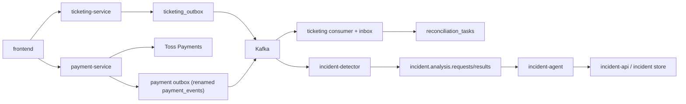

# 이벤트 아키텍처 설계

## 1. 문서 목적과 기준

이 문서는 현재 MSA 구조 위에 올라갈 `이벤트 아키텍처 최종 설계 기준서`다.

문서의 목적은 아래와 같다.

- `payment-service` 와 `ticketing-service` 중심의 이벤트 backbone 구조를 최종 steady-state 기준으로 고정한다.
- 어떤 사실을 이벤트로 기록할지, 어떤 서비스가 outbox 또는 신뢰성 있는 작업 기록 테이블을 가져야 하는지, Kafka를 어디에 붙일지를 구현 직전 수준으로 닫는다.
- `서비스 운영/완성도 설계` 와 충돌하지 않도록 truth source, workflow owner, 금지 패턴을 그대로 상속한다.
- `결제 운영 진단 Agent 상세 설계` 가 기대하는 detector/agent 입력 구조와 자연스럽게 이어지도록 이벤트 계약을 고정한다.

상위 기준 문서:

- [서비스_운영_완성도_설계.md](/Users/yangyewon/workspace/SKALA-Mini-Project-2/yewon/docs/서비스_운영_완성도_설계.md)

하위 연계 문서:

- `결제 운영 진단 Agent 상세 설계`

### 비목표

- 현재 내부 HTTP 기반 과도기 구조를 최종 구조로 승인하는 문서
- 모든 서비스에 Kafka를 일괄 도입하는 문서
- CDC/Debezium 도입을 이번 단계에서 채택하는 문서
- 운영자 승인 없는 자동 환불, 자동 강제 확정, 자동 강제 취소를 허용하는 문서

### 상속 원칙

- 결제 truth source 는 `payment-service` 다.
- booking/seat/inventory truth source 는 `ticketing-service` 다.
- mismatch 복구 workflow owner 는 `ticketing-service` 다.
- `queue-service`, `user-auth-service`, `concert-service` 는 이번 backbone 검토 대상이지만 핵심 경계가 아닐 수 있으며, 비채택 시 이유를 명시한다.

## 2. 최종 이벤트 Backbone 구조

최종 steady-state 구조는 아래를 기준으로 한다.

핵심 원칙:

- `payment-service` 는 payment truth 를 기록하고 payment 이벤트를 발행한다.
- `ticketing-service` 는 booking/seat truth 를 기록하고 ticketing 이벤트를 발행한다.
- `ticketing-service` 는 payment 결과 이벤트를 소비해 finalization 을 수행하고, 실패 시 `reconciliation_tasks` 로 복구를 이어간다.
- detector/agent 는 payment/ticketing 이벤트를 Kafka 에서 소비한다.
- reconciliation 내부 재처리 루프는 Kafka 로 보내지 않고 `reconciliation_tasks + scheduler` 로 유지한다.

## 3. 서비스별 이벤트 채택/비채택 결정

### 3.1 최종 결정 표

| 서비스 | 기록할 사실 | 외부 소비 필요 여부 | Outbox 필요 여부 | Kafka 연결 여부 | Detector/Agent 소비 대상 여부 | 최종 결정 | 비채택 사유 |
|---|---|---|---|---|---|---|---|
| `payment-service` | payment 상태 전이, refund 전이, webhook 수신 | 높음 | 필요 | 사용 | 사용 | 채택 | 해당 없음 |
| `ticketing-service` | booking/seat/finalization/reconciliation 전이 | 높음 | 필요 | 사용 | 사용 | 채택 | UI 세션성 이벤트는 제외 |
| `queue-service` | queue 진입/승인/이탈/만료/drift 후보 | 낮음 | 불필요 | 미사용 | 미사용 | 비채택 | 핵심 정합성 복구 경계가 아님 |
| `user-auth-service` | user 생성/변경, 이메일 인증 완료 후보 | 낮음 | 불필요 | 미사용 | 미사용 | 비채택 | incident 핵심 흐름과 직접 연결되지 않음 |
| `concert-service` | concert/schedule/seat-map 변경 후보 | 낮음 | 불필요 | 미사용 | 미사용 | 비채택 | catalog 전파는 이번 문서 핵심이 아님 |

### 3.2 payment-service 채택 범위

최종 설계에 포함하는 이벤트:

- `payment.created`
- `payment.submitted`
- `payment.paid`
- `payment.confirmed`
- `payment.failed`
- `payment.expired`
- `payment.refund_required`
- `refund.requested`
- `refund.completed`
- `pg.webhook.received`

포함 이유:

- 결제 truth 의 전이 사실이다.
- `ticketing-service` finalization 과 detector incident 판별에 직접 필요하다.
- replay, dedupe, audit, refund 판단의 기준점이다.

명시적 비채택:

- `payment-service` 내부 scheduler health 응답
- `payment-service` 운영 요약 API 응답

비채택 이유:

- 운영 메트릭/운영 API 로 충분하다.
- 도메인 사건이 아니라 관측 결과다.

### 3.3 ticketing-service 채택 범위

최종 설계에 포함하는 이벤트:

- `booking.created`
- `booking.confirming`
- `booking.confirmed`
- `booking.canceled`
- `booking.expired`
- `seat.held`
- `seat.hold_released`
- `seat.reserved`
- `ticketing.finalization.started`
- `ticketing.finalization.completed`
- `ticketing.finalization.failed`
- `ticketing.reconciliation.requested`
- `ticketing.reconciliation.completed`
- `reconciliation.failed_permanent`

포함 이유:

- booking/seat truth 의 전이 사실이다.
- detector 가 유령 주문, 좀비 예약, 복구 실패를 판별하는 핵심 근거다.
- payment 결과 후처리의 성공/실패를 운영 계층과 분리해서 관찰해야 한다.

명시적 비채택:

- 좌석 화면 입장 이벤트
- 좌석 화면 이탈 이벤트
- 프론트엔드 UI 세션성 상태

비채택 이유:

- 운영 incident 핵심 정합성과 직접 연결되지 않는다.
- 필요 시 후속 사용자 행동 분석 계층에서 별도 다루는 것이 맞다.

### 3.4 queue-service 비채택 범위

검토한 후보:

- `queue.entered`
- `queue.admitted`
- `queue.left`
- `queue.expired`
- `queue.active_drift_detected`

최종 결정:

- 이번 backbone 에서는 비채택

비채택 이유:

- payment/ticketing 정합성 복구의 핵심 경계가 아니다.
- detector 입력으로 유용할 수 있으나, 이번 최종 이벤트 아키텍처의 필수 축은 아니다.
- 운영 메트릭, Redis 상태, 후속 확장 후보로 남기는 편이 더 단순하다.

### 3.5 user-auth-service 비채택 범위

검토한 후보:

- `user.created`
- `user.updated`
- `email.verification.completed`

최종 결정:

- 비채택

비채택 이유:

- payment/ticketing mismatch 와 직접 연결되지 않는다.
- backbone 범위를 넓히는 비용 대비 즉시 가치가 작다.

### 3.6 concert-service 비채택 범위

검토한 후보:

- `concert.updated`
- `schedule.opened`
- `seat-map.changed`

최종 결정:

- 비채택

비채택 이유:

- catalog 변경 전파는 별도 문제다.
- booking/payment/finalization/reconciliation 보다 우선순위가 낮다.

## 4. Outbox / Inbox / Reconciliation / Kafka 설계

### 4.1 저장 구조 최종안

| 서비스 | 테이블/구조 | 역할 | 최종 결정 |
|---|---|---|---|
| `payment-service` | `payment_events` | payment 발행 outbox | 유지하되 outbox 역할로 승격 |
| `ticketing-service` | `ticketing_inbox_events` | 수신 dedupe 및 ingress 추적 | 유지 |
| `ticketing-service` | `ticketing_outbox` | ticketing 발행 outbox | 신규 도입 |
| `ticketing-service` | `reconciliation_tasks` | 복구 작업 저장/재처리 | 유지 |

### 4.2 payment outbox 결정

최종안:

- 현재 `payment_events` 를 발행 outbox 로 승격해 사용한다.
- 별도 `payment_outbox` 는 두지 않는다.
- 이름은 outbox 역할이 드러나도록 정리한다.

이유:

- 현재 `payment_events` 는 이미 event metadata 를 충분히 담고 있다.
- 동일 의미의 로그/큐 테이블을 분리하면 구현 복잡도와 이중 기록 부담이 커진다.
- payment 쪽은 `이벤트 로그 = 발행 원본` 으로 가져가도 의미 혼선이 작다.

필수 추가 속성:

- `publish_status`
- `published_at`
- `retry_count`
- `last_error`

### 4.3 ticketing outbox 결정

최종안:

- `ticketing_inbox_events` 는 수신 전용으로 유지한다.
- 발행은 별도 `ticketing_outbox` 를 사용한다.

이유:

- `ticketing_inbox_events` 는 현재 dedupe 와 ingress 추적 의미가 강하다.
- 수신/발행을 한 테이블에 섞으면 의미와 운영 쿼리가 불명확해진다.
- `ticketing-service` 는 reconciliation 까지 함께 가지므로 역할 분리가 특히 중요하다.

### 4.4 Kafka 채택 경계

최종 채택 경계:

| 경계 | Kafka 채택 여부 | 이유 |
|---|---|---|
| `payment-service -> ticketing-service` | 채택 | 핵심 사건 정합성 복구, retry, replay, consumer 분리에 필요 |
| `payment-service -> detector` | 채택 | payment incident 판별 근거 제공 |
| `ticketing-service -> detector` | 채택 | booking/seat/finalization/reconciliation incident 판별 근거 제공 |
| `incident-detector -> incident-agent` | 채택 | 비동기 분석 요청/결과 분리 |
| `incident-agent -> incident-api or analysis result store` | 채택 | 분석 결과 비동기 처리 및 backlog 보호 |

명시적 미채택 경계:

| 경계 | Kafka 미채택 여부 | 이유 |
|---|---|---|
| `queue-service -> detector` | 미채택 | 핵심 backbone 필수 경계 아님 |
| `user-auth-service -> downstream` | 미채택 | 이번 문서 문제 범위 밖 |
| `concert-service -> downstream` | 미채택 | catalog 문제는 별도 주제 |
| `ticketing reconciliation internal retry` | 미채택 | `reconciliation_tasks + scheduler` 가 더 단순하고 적합 |

## 5. Retry / DLQ / Ordering / Partition Key / CDC 결정

### 5.1 토픽 전략 최종안

토픽은 도메인 묶음 토픽으로 고정한다.

- `payment.events.v1`
- `ticketing.events.v1`
- `incident.analysis.requests.v1`
- `incident.analysis.results.v1`

비채택:

- `payment.payment.confirmed.v1` 같은 타입별 토픽 분리

비채택 이유:

- 토픽 수가 빠르게 늘어난다.
- detector 소비 로직과 운영 관리가 더 복잡해진다.
- 현재 문제는 타입별 물리 분리보다 도메인별 일관된 흐름 보장이 더 중요하다.

### 5.2 Partition Key 와 Ordering 규칙

partition key 고정:

- payment 계열: `paymentId`
- booking/seat/finalization/reconciliation 계열: `bookingId`
- incident analysis 요청/결과: `incidentId`

ordering 규칙:

- 같은 partition key 내부 순서만 Kafka ordering 에 기대한다.
- cross-topic 완전 순서는 보장 대상으로 두지 않는다.
- detector 는 `occurredAt`, 최신 상태, 이벤트 존재 여부를 함께 본다.

### 5.3 Retry / DLQ 규칙

producer 측:

- outbox relay 는 bounded retry 를 사용한다.
- 재시도 한도 초과 시 outbox row 를 `FAILED` 상태로 전환한다.
- failed row 는 운영 replay 대상이 된다.

consumer 측:

- bounded retry 를 사용한다.
- 재시도 한도 초과 시 DLQ 로 이동한다.

business mismatch:

- DLQ 로 보내지 않는다.
- `reconciliation_tasks` 생성 또는 `incident` 생성으로 이어간다.

### 5.4 CDC 결정

최종 결정:

- 미채택

이유:

- 현재 공용 Postgres 과도기다.
- 앱이 기록하는 도메인 의미를 명시적으로 통제하는 outbox 가 더 적합하다.
- Debezium/CDC 는 운영 복잡도가 높고, 이번 설계 목표에 비해 이득이 작다.

장기 확장 메모:

- 향후 RDS/Aurora 안정화와 다중 소비자 확장이 크게 요구되면 재평가할 수 있다.

## 6. Detector / Agent 소비 계약

### 6.1 공통 이벤트 메타 필드

모든 backbone 이벤트는 아래 메타를 가진다.

| 필드 | 설명 |
|---|---|
| `eventId` | 전역 유일 이벤트 ID |
| `eventType` | 이벤트 타입 |
| `eventVersion` | 이벤트 버전 |
| `occurredAt` | 이벤트 발생 시각 |
| `producer` | 발행 서비스명 |
| `aggregateType` | aggregate 종류 |
| `aggregateId` | aggregate ID |
| `orderingKey` | 파티션 키 |
| `idempotencyKey` | 멱등성 키 |
| `correlationId` | 흐름 추적 ID |
| `causationId` | 직전 원인 이벤트 ID |
| `traceId` | tracing ID |
| `payload` | 도메인 payload |

### 6.2 detector 최소 입력 집합

detector 입력에 포함하는 이벤트:

- payment 계열 전이 이벤트 전부
- booking 계열 전이 이벤트 전부
- seat hold/release/reserve 이벤트
- finalization 시작/성공/실패 이벤트
- reconciliation 요청/완료/영구 실패 이벤트

detector 입력에서 제외:

- queue 이벤트
- user-auth 이벤트
- concert 이벤트

제외 이유:

- 이번 최종 backbone 의 핵심 incident 유형을 판단하는 데 필수는 아니다.

### 6.3 PII 규칙

이벤트 payload 와 detector/agent 입력에는 아래를 포함하지 않는다.

- email
- phone
- raw payment 민감 정보
- 카드/계좌 원문 식별자

대신 아래 식별자를 중심으로 전달한다.

- `paymentId`
- `bookingId`
- `userId`
- `concertId`
- `scheduleId`
- `seatIds`
- `reasonCode`
- `pgOrderId`
- 필요 시 마스킹된 `pgPaymentKey`

### 6.4 incident 매핑 기준

이 설계는 아래 incident 판단을 지원해야 한다.

| incident | 핵심 신호 |
|---|---|
| 중복 결제 | 같은 `bookingId` 에 복수 `payment.confirmed` 또는 `payment.paid` |
| 유령 주문 | `payment.paid` 또는 `payment.confirmed` 후 `booking.confirmed` 또는 `seat.reserved` 누락 |
| 좀비 예약 | hold 만료 이후 `seat.hold_released` 누락 또는 lock 잔존 |
| 미확정 결제 | `pg.webhook.received` 이후 `payment.confirmed` 누락 |

## 7. 전환 기준점

현재 구조는 아래 과도기 상태다.

- `payment-service -> ticketing-service` 는 internal HTTP finalization 사용 중이다.
- `payment_events` 는 현재 로그 성격이 강하고, `ticketing_inbox_events` 는 ingress dedupe 성격이다.
- 구현 시에는 `payment-service -> ticketing-service` HTTP 경로를 Kafka 소비로 대체한다.
- `ticketing_inbox_events` 와 `reconciliation_tasks` 는 재사용 또는 확장한다.

이 전환 메모는 현재와 목표를 연결하기 위한 참고이며, 본문 목표 구조를 약화시키지 않는다.

## 8. 설계 검증 시나리오

이 문서는 아래 시나리오를 설명할 수 있어야 완성으로 본다.

1. `payment created -> submitted -> confirmed -> booking confirmed -> seat reserved`
2. `payment confirmed but invalid hold -> reconciliation 또는 refund_required`
3. 동일 booking 에 대한 duplicate payment confirmed
4. webhook received but internal payment not confirmed
5. finalization failed and reconciliation task created
6. 같은 inbound event replayed and inbox dedupe applied

각 시나리오마다 아래가 문서에 드러나야 한다.

- 어떤 이벤트가 남는가
- 어느 테이블에 저장되는가
- Kafka 로 나가는가
- 누가 소비하는가
- 실패 시 DLQ 인지 reconciliation 인지 incident 인지
- detector/agent 가 충분한 timeline 을 복원할 수 있는가
